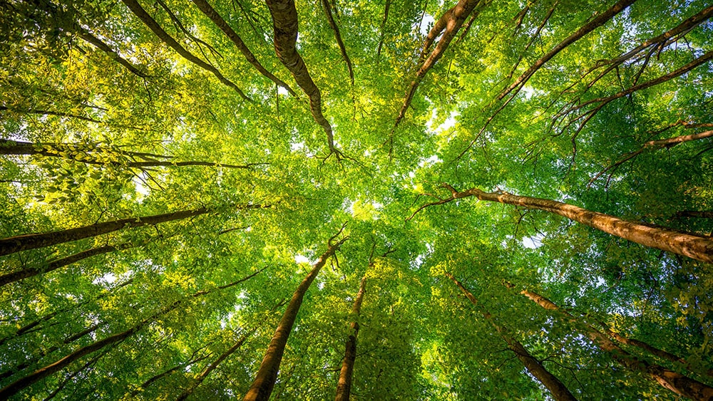

# Explore the rainforest!

---

## You should visit because

Experience the beauty of the oldest continuously surviving rainforest in the world by living high above the canopy in our unique eco cabin.

[link to](#worried-about-heights)

---

## Worried about heights?

You get a free personal parachute to ensure you can enjoy your holiday in comfort.

1. **It's portable:** Be safe 24/7 without even noticing you're wearing it.
2. **It's reliable:** Works in all temperatures and doesn't need to be serviced.
3. **It's smart:** Each parachute is GPS tracked so as soon as you descend, we'll have you back in the treehouse within 60 minutes.

---

## Testimonials

Some glowing reviews from previous happy tree-dwellers.

> "I loved being above the trees, it was magical!" - Julie

> "I didn't fall out once - Andrew

---

## About the wet tropics

Watch our video!

<iframe width="560" height="315" src="https://www.youtube.com/embed/cB6hbgS1YZg" frameborder="0" allow="accelerometer; autoplay; encrypted-media; gyroscope; picture-in-picture" allowfullscreen></iframe>

---

## Treefindr app

Enhance your canopy experience with our free app.

1. **It's educational:** Explore the forest canopy with rich AR enhancements, enhancing your understanding of tree spexies and wildlife.
2. **It's Social:** Share your finds to show off your holiday and highlight the importance of conservation.
3. **It's rewarding:** Share pics you take with the app. The best ones get you discounts towards your next trip.

---

## Latest from Instagram

- 
- 